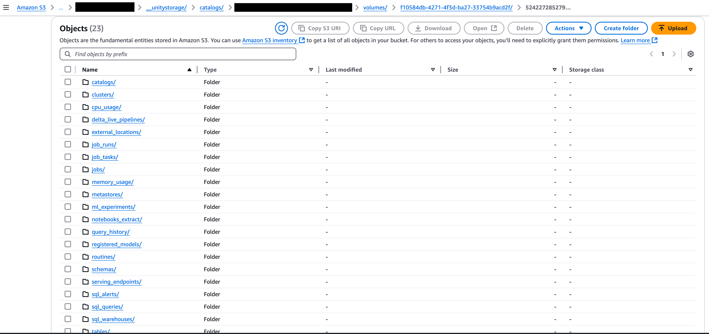
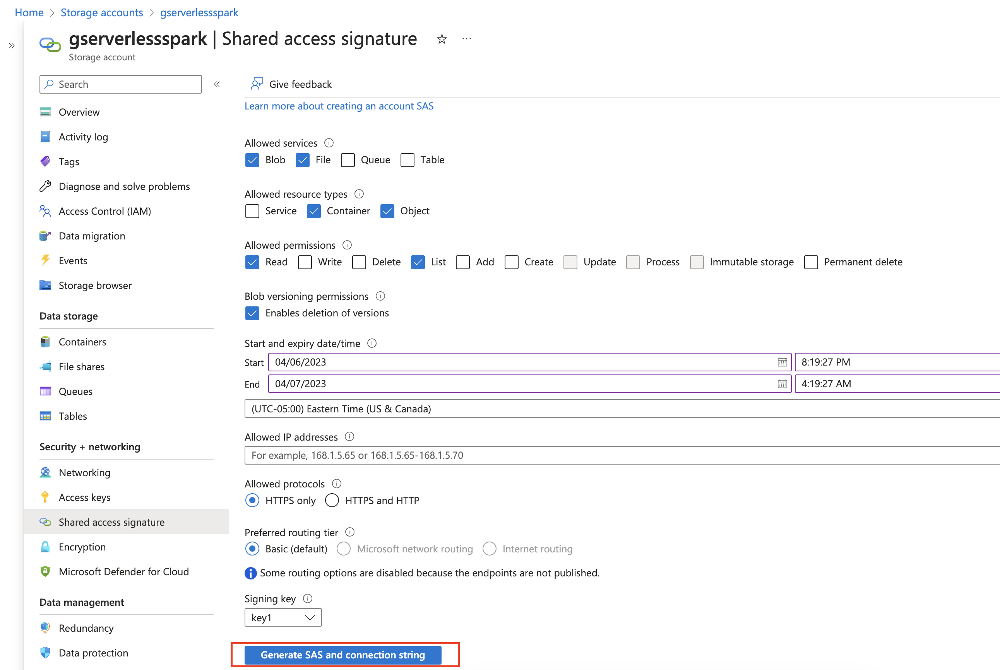

# Databricks Discovery Tool (Cloud Agnostic)

The tool is intended to be executed within the Databricks environment (Azure/AWS/GCP). It leverages the Databricks SDK and captures a wide range of deployment characteristics. The output empowers customers to effectively design their GCP solution and accelerate their migration process. Run this tool within your Databricks Workspace.

# 1. Clone Repo

- **Option 1** - Use below to clone
  
  ```commandline
  git clone https://github.com/sqlmartini/databricks-assessment-tool.git

  ```

- **Option 2** - [Clone it in your databricks workspace](https://docs.databricks.com/aws/en/repos/git-operations-with-repos#clone-a-repo-connected-to-a-remote-git-repository) 


# 2. Copy folder `databricks-assessment-tool/` to a Databricks folder.
> Skip this step if you've cloned this repo in databricks workspace directly using **Option 2** above. 


# 3. Follow the execution steps in notebook `databricks-assessment-tool/scripts/starter.ipynb`

> **Important:**
> This tool will create a temporary Databricks SQL Warehouse to execute queries against Unity Catalog system tables. The warehouse will be automatically deleted after the queries have finished running. Please ensure you have the necessary permissions to create and delete SQL Warehouses in your Databricks workspace.

- On a successful execution, tool will create a folder with name `data/{workspace_id}` and sub-folders having metadata inside.


## 3.1. Steps to transfer data files from Databricks Workspace to S3/ADLS

- This step is done within the notebook `databricks-assessment-tool/scripts/starter.ipynb` 

> **Key Considerations**
> * **Unity Catalog Volume Existence:**
    * The tool leverages Unity Catalog Volumes to copy files from local file system to target location
    * **Critical:** The target location in Unity Catalog Volume **must exist**.
    * Refer [Create an External Volume in Databricks](https://docs.databricks.com/aws/en/sql/language-manual/sql-ref-volumes#examples) on creating and managing volumes.
> * **Underlying External Location and Storage Credential:**
    * **Critical:** The **external location** that underpins the Volume **must be registered** in Unity Catalog.
    * **Critical:** The **storage credential** associated with the external location **requires precise write permissions** on the cloud storage path where the volume is rooted.
    * Failure to register the external location or grant sufficient permissions on the storage credential will result in write failures.
    * Reference: [Create an external location manually using Catalog Explorer](https://docs.databricks.com/aws/en/connect/unity-catalog/cloud-storage/external-locations#create-an-external-location-manually-using-catalog-explorer) (or equivalent documentation for your cloud provider).


**Output**
  * On successful execution, data and metadata are written to the specified S3/ADLS location
  * A folder named `{workspace_id}` will be created at location
  * This folder will contain sub-folders with the generated metadata. Refer sample screenshot of the folder structure in Amazon S3.

    


# 4. Transfer Data to GCS
## 4.1. GCP Storage Transfer Service - Azure to GCP

[Storage transfer Service](https://cloud.google.com/storage-transfer/docs/overview) is used to move metadata capture
JSON files generated from Azure Databricks Notebooks into GCP's Cloud Storage. These files will then serve as input to
the BigQuery tables.  

This document demonstrates how to set up GCP's Storage transfer Service to move JSON files generated from Databricks
notebooks from an Azure Blob Storage to GCP Cloud Storage. Along with moving newly created files from Azure's source
container, files will also be deleted from GCP cloud storage bucket if they are removed from the source Azure container.

### 4.1.1. Prerequisites
1. Access to Azure's Blob storage container with the source files
2. Enable GCP APIs: Run  `gcloud services enable storage.googleapis.com bigquery storagetransfer`


### 4.1.2. Create Cloud storage buckets to capture metadata
Run the following commands in cloud shell -

```commandline
PROJECT_ID=`gcloud config list --format "value(core.project)" 2>/dev/null`
PROJECT_NBR=`gcloud projects describe $PROJECT_ID | grep projectNumber | cut -d':' -f2 |  tr -d "'" | xargs`
LOCATION="us-central1"
METADATA_BUCKET="<NEW_BUCKET_NAME>" 
```

```commandline
gcloud storage buckets create gs://$METADATA_BUCKET \
--project=$PROJECT_ID \
--default-storage-class=STANDARD \
--location=$LOCATION
```

### 4.1.3. Transfer Service Setup
Run the following commands in cloud shell after replacing values for Azure Storage account and container.

- **Export variables**
  
  ```commandline
  TRANSFER_JOB="AzureBlob_to_GCS"
  AZURE_STORAGE_ACC="<STORAGE_ACCOUNT>"
  AZURE_CONTAINER="<CONTAINER>"
  ```

- **Grant Service agent legacyBucketWriter role**
  
  ```commandline
  gcloud storage buckets add-iam-policy-binding gs://$METADATA_BUCKET \
  --member=serviceAccount:project-$PROJECT_NBR@storage-transfer-service.iam.gserviceaccount.com \
  --role=roles/storage.legacyBucketWriter
  ```

- **Generate Azure Blob storage's Shared Access Signature**
  1. From [Azure Home](https://portal.azure.com/#home) to go Storage Accounts
  2. Select the Storage account that contains files to be transferred
  3. Click on Shared Access Signature
  4. Update the configurations as seen in the screenshot below
      
  5. Click on Generate SAS and connection string(highlighted in red) button
  6. Copy SAS token as this will be needed in upcoming steps
  7. Run the following commands in cloud shell to create a credential file
      
      ```commandline
      vi creds.json
      ```
  8. Insert the following JSON object and replace the TOKEN with SAS token value
      ```commandline
      {
        "sasToken": "<TOKEN>"
      }
      ```

- **Create Transfer Service Job**
  
  ```commandline
  gcloud transfer jobs create \
  https://$AZURE_STORAGE_ACC.blob.core.windows.net/$AZURE_CONTAINER \
  gs://$METADATA_BUCKET \
  --name=$TRANSFER_JOB \
  --description="Move files from Azure to GCS" \
  --source-creds-file=creds.json \
  --do-not-run \
  --overwrite-when=different \
  --delete-from=destination-if-unique
  ```

- **Delete the credential file**
  
  ```commandline
  rm -rf creds.json
  ```

- **Run Transfer service job**
  
  ```commandline
  gcloud transfer jobs run transferJobs/$TRANSFER_JOB
  ```

## 4.2. GCP Storage Transfer Service - AWS to GCP

[Storage transfer Service](https://cloud.google.com/storage-transfer/docs/overview) is used to move metadata capture
JSON files generated from AWS Databricks Notebooks into GCP's Cloud Storage. These files will then serve as input to
the BigQuery tables.  
This document demonstrates how to set up GCP's Storage transfer Service to move JSON files generated from Databricks
notebooks from an S3 bucket to GCP Cloud Storage. Along with moving newly created files from S3 bucket, files will also be deleted from GCP cloud storage bucket if they are removed from the source S3 bucket.

### 4.2.1. Prerequisites
1. Access to S3 bucket/folder with the source files
2. Enable GCP APIs: Run  `gcloud services enable storage.googleapis.com bigquery storagetransfer`


### 4.2.2. Create Cloud storage buckets to capture metadata

Run the following commands in cloud shell -

```commandline
PROJECT_ID=`gcloud config list --format "value(core.project)" 2>/dev/null`
PROJECT_NBR=`gcloud projects describe $PROJECT_ID | grep projectNumber | cut -d':' -f2 |  tr -d "'" | xargs`
LOCATION="us-central1"
METADATA_BUCKET="<NEW_BUCKET_NAME>" 
```

```commandline
gcloud storage buckets create gs://$METADATA_BUCKET \
--project=$PROJECT_ID \
--default-storage-class=STANDARD \
--location=$LOCATION
```

### 4.2.3. Transfer Service Setup
Run the following commands in cloud shell after replacing values for AWS S3 bucket name and folder path.

- **Export variables**
  
  ```commandline
  TRANSFER_JOB="AWS_S3_to_GCS"
  AWS_S3_BUCKET_NAME="<S3_BUCKET_NAME>"
  AWS_FOLDER_PATH="<FOLDER_PATH>"
  ```

- **Grant Service agent legacyBucketWriter role**
  
  ```commandline
  gcloud storage buckets add-iam-policy-binding gs://$METADATA_BUCKET \
  --member=serviceAccount:project-$PROJECT_NBR@storage-transfer-service.iam.gserviceaccount.com \
  --role=roles/storage.legacyBucketWriter
  ```

- **Store the secret key to connetc to AWS S3**
  1. Run the following commands in cloud shell to create a credential file
      
      ```commandline
      vi creds.json
      ```
  2. Insert the following JSON object and replace the TOKEN with SAS token value
      
      ```commandline
      {
        "accessKeyId": "<access_key>",
        "secretAccessKey": "<secret_key>"
      }
      ```

- **Create Transfer Service Job**
  
  ```commandline
  gcloud transfer jobs create \
  s3://$AWS_S3_BUCKET_NAME/$AWS_FOLDER_PATH \
  gs://$METADATA_BUCKET \
  --name=$TRANSFER_JOB \
  --description="Move files from AWS to GCS" \
  --source-creds-file=creds.json \
  --do-not-run \
  --overwrite-when=different \
  --delete-from=destination-if-unique
  ```

- **Delete the credential file**
  
  ```commandline
  rm -rf creds.json
  ```

- **Run Transfer service job**
  ```commandline
  gcloud transfer jobs run transferJobs/$TRANSFER_JOB
  ```


# 5. BQ Loader (Will be run by Googlers like CEs or PSO Consultants)
1. In GCP, ensure User/ServiceAccount running the BQ load has StorageAdmin Permissions & BigQuery Admin permissions
2. Open Cloud Shell from the Cloud Console
3. Copy the `bq_loader.py` file to Cloud Shell
4. Run the script to create dataset, create tables and load the data
    
    ```commandline
    python bq_loader.py --project <GCP_PROJECT_ID> --dataset <BQ_DATASET> --bucket <GCS_BUCKET> --prefix <OPTIONAL_GCS_BUCKET_PATH>
    ```

----

## Authors
- [Kiran Innamuri](https://github.com/kiran0541)
- [Rishab Khawad](https://github.com/rishabkhawad)
- [Vanshaj Bhatia](https://github.com/vanshaj-bhatia)
- [Nikhil Manjunatha](https://github.com/nikhil6790)
- [Palak Patel](https://github.com/ppatel54)

